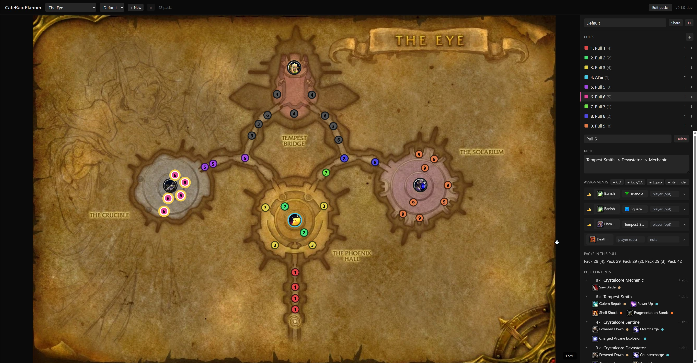

<picture>
  <source media="(prefers-color-scheme: dark)" srcset="docs/logo-dark.png">
  
</picture>

# CafeRaidPlanner (web)

Browser-based pull planner for TBC Classic raids. Drop pack markers on the
raid map, group them into pulls, assign cooldowns and CCs, then share the
plan with the rest of the raid through the
[companion addon](https://github.com/cafewow/CafeRaidPlanner).

Think of it as MDT, but for TBC raids instead of M+ dungeons.

**Live at <https://cafewow.github.io/CafeRaidPlanner-Web/>.** No login, no
backend — everything you build lives in your browser.

## What it looks like



The map on the left shows pack positions for the raid (currently SSC, TK,
Gruul, Magtheridon). The right pane is your pull list and assignments.
Click a pull to edit its packs, notes, and per-player cooldowns / kicks /
equip swaps.

## What you can do

- **Place packs.** Edit mode lets you drag pack markers around the map,
  resize them, set their mob composition, and mark patrol paths. Bosses are
  ordinary packs with a slug and an icon, so they live in the same list and
  move the same way.
- **Plan pulls.** Group packs into pulls. Each pull gets a name, a note,
  and an assignment list.
- **Assign anything.** Cooldowns (class spells), consumables (potions,
  drums), engineering toys, equip swaps (rocket boots, parachute cloak),
  and kicks/CC (interrupts, sheep, sap, banish, cyclone…). Kicks/CC target
  a raid marker or a specific mob.
- **Save multiple plans per raid.** Switch between presets from the
  header dropdown.
- **Share.** Click Share, copy the `crp1.…` string, paste into the addon's
  import dialog. The plan reconstructs exactly on the other side.

## Local development

```
npm install
npm run dev
```

Opens at `http://localhost:5173/`.

```
npm run build
```

Outputs to `dist/`. The Pages base path is `/CafeRaidPlanner-Web/`; set
`BASE_URL` at build time to host elsewhere.

GitHub Pages deploys via `.github/workflows/deploy.yml` on every push to
`main`. The one-time setup is **Settings → Pages → Source: GitHub Actions**.

## Related

- Companion addon: [cafewow/CafeRaidPlanner](https://github.com/cafewow/CafeRaidPlanner)
- Architecture / contributor notes: `PROJECT.md` in the repo root
